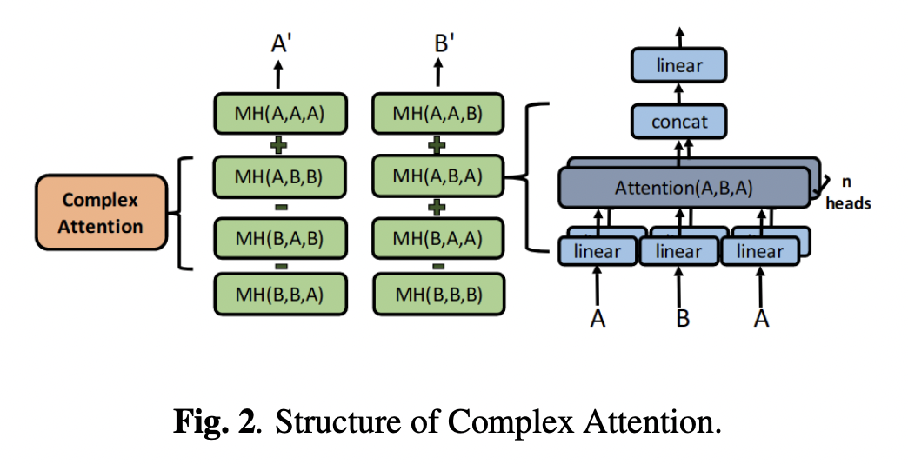

</img>

## Complex Valued Transformer (wip)

Implementation of the transformer proposed in <a href="https://arxiv.org/abs/2306.09827">Building Blocks for a Complex-Valued Transformer Architecture</a>, plus a few other proposals from related papers. The full architecture will be evaluated on enwik8 character level language modeling as well as some algorithmic tasks (parity, binary addition).

Will not bother with complex layernorm, as RMS norm is now much more popular.

## Install

```bash
$ pip install complex-valued-transformer
```

## Usage

```python
import torch
from complex_valued_transformer import ComplexTransformer

transformer = ComplexTransformer(
    num_tokens = 256,
    dim = 512,
    depth = 4,
    dim_head = 32,
    heads = 8,
    causal = True,
    complete_complex = True
)

ids = torch.randint(0, 100, (2, 1024))

logits = transformer(ids) # (2, 1024, 256)
```

## Todo

- [ ] flash attention v1 compat
- [ ] add rotary embeddings, formulated in complex domain
- [ ] consider integrating with <a href="https://github.com/lucidrains/BS-RoFormer">BS-RoFormer</a>

## Citations

```bibtex
@article{Eilers2023BuildingBF,
    title   = {Building Blocks for a Complex-Valued Transformer Architecture},
    author  = {Florian Eilers and Xiaoyi Jiang},
    journal = {ArXiv},
    year    = {2023},
    volume  = {abs/2306.09827},
    url     = {https://api.semanticscholar.org/CorpusID:258542729}
}
```

```bibtex
@article{Yang2019ComplexTA,
    title    = {Complex Transformer: A Framework for Modeling Complex-Valued Sequence},
    author   = {Muqiao Yang and Martin Q. Ma and Dongyu Li and Yao-Hung Hubert Tsai and Ruslan Salakhutdinov},
    journal  = {ICASSP 2020 - 2020 IEEE International Conference on Acoustics, Speech and Signal Processing (ICASSP)},
    year     = {2019},
    pages    = {4232-4236},
    url      = {https://api.semanticscholar.org/CorpusID:204838137}
}
```

```bibtex
@article{Dong2021SignalTC,
    title   = {Signal Transformer: Complex-valued Attention and Meta-Learning for Signal Recognition},
    author  = {Yihong Dong and Ying Peng and Muqiao Yang and Songtao Lu and Qingjiang Shi},
    journal = {ArXiv},
    year    = {2021},
    volume  = {abs/2106.04392},
    url     = {https://api.semanticscholar.org/CorpusID:235367992}
}
```

```bibtex
@inproceedings{dao2022flashattention,
    title   = {Flash{A}ttention: Fast and Memory-Efficient Exact Attention with {IO}-Awareness},
    author  = {Dao, Tri and Fu, Daniel Y. and Ermon, Stefano and Rudra, Atri and R{\'e}, Christopher},
    booktitle = {Advances in Neural Information Processing Systems},
    year    = {2022}
}
```
